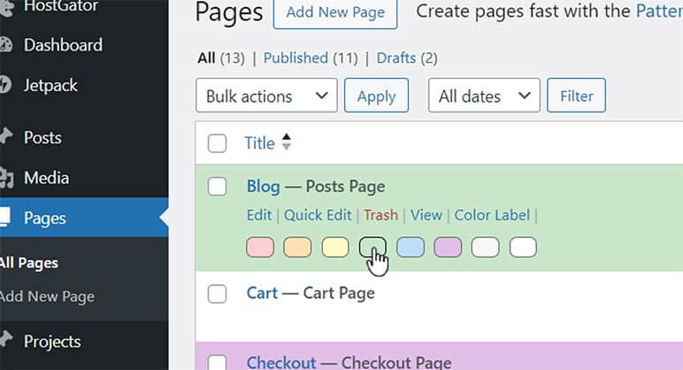

# Color Labels for Posts and Pages

A WordPress plugin to color-label rows for Posts and Pages in the WordPress Dashboard.

## Description

This plugin allows you to tag or color-label the individual rows of Pages and Posts in the WordPress Dashboard for ease of navigation.

### Features
- Color-label rows under the "All Posts" screen.
- Color-label rows under the "All Pages" screen.
- Seamlessly integrates into the WordPress admin interface.

### Benefits
- Improved organization of posts and pages.
- Quick visual identification of different content items.
- Enhanced workflow efficiency.

## Installation

1. Upload the `color-labels-for-posts-and-pages` folder to the `/wp-content/plugins/` directory.
2. Activate the plugin through the 'Plugins' screen in WordPress.
3. Navigate to the "Posts" or "Pages" sections in the WordPress Dashboard.
4. Hover over a post or page title and click the "Color-Label" link.
5. Use the color picker interface to select a predefined color or enter a custom color.

## Usage

- Hover over a post/page title and click the "Color Label" link.
- Select a color from the predefined options or enter a custom color code.

## Frequently Asked Questions

### How do I change the colors?

By clicking the 'color label' link in each post/page menu item (within the menu that includes 'Edit', 'Quick Edit', etc.), you can select from predefined colors, including the default white & light grey for these rows.

### Can I remove a color label?

Yes, in the way of replacing a color with white or very light grey, which are default WordPress colors for these rows of pages and posts. When deactivating this plugin, all color labels done with this plugin will vanish.

## Screenshots

## Changelog

### 1.1.5
- Secured with sanitization and nonces.
- The area where swatches show up in the PPMIs (posts and pages menu items) goes away when clicking outside of PPMI where color swatch menu had shown up, unlike in the previous version where it was a brand new feature for color swatches to show up in that area.

### 1.0
- Initial release.

## License

This plugin is licensed under the GPLv2 or later.

## Stable Tag

1.1.5

## Donations

If you find this plugin useful, consider supporting its development with a donation. [Donate here](https://www.venmo.com/u/bridean77).