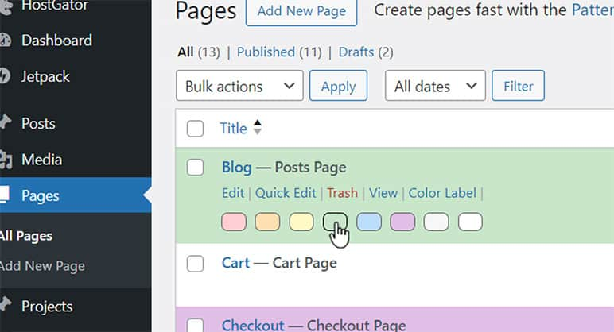

# Color Labels for Posts and Pages

A WordPress plugin that lets Dashboard users color-label individual Post and Page rows in the admin list screens, making content faster to scan and navigate.

**Status:** Passed WordPress.org Plugin Check (PCP) &nbsp;•&nbsp; Current version: `1.2.0` &nbsp;•&nbsp; License: GPLv2 or later

---

## About This Project

This is a production-ready WordPress plugin built from the ground up — custom PHP, JavaScript, and CSS, with no framework scaffolding or boilerplate generator. It was developed end-to-end using an **AI-first development workflow** (Claude Code integrated with VS Code), covering architecture, iterative refactoring, security hardening, and preparation to meet WordPress.org's official submission standards.

It's intentionally a focused, single-purpose plugin — the goal was not scope, but doing a small thing to a professional bar: clean enqueue practices, proper sanitization and nonce use, capability checks, and compliance with WordPress coding and security guidelines.

**Engineering highlights:**

- **Built to WordPress.org standards** — passes the official Plugin Check (PCP) tool, resolving all flagged compliance items across multiple review iterations.
- **Security-minded** — AJAX handlers hardened with nonce verification and capability checks; direct-access guard (`ABSPATH`) in place; all input sanitized and output escaped.
- **Proper asset handling** — scripts and styles enqueued conditionally, scoped only to the Posts/Pages list screens rather than loaded globally.
- **AI-augmented workflow** — architected and iteratively refined with Claude Code + VS Code, demonstrating an AI-first engineering process end to end.
- **Clean version history** — semantic versioning with a documented changelog tracing each fix and refinement.

**Tech:** PHP (60%) · JavaScript (35%) · CSS (5%)

---

## Description

This plugin allows you to tag or color-label the individual rows of Pages and Posts in the WordPress Dashboard for ease of navigation.

### Features

- Color-label rows under the **All Posts** screen.
- Color-label rows under the **All Pages** screen.
- Seamlessly integrates into the WordPress admin interface.

### Benefits

- Improved organization of posts and pages.
- Quick visual identification of different content items.
- Enhanced workflow efficiency.

---

## Installation

1. Upload the `color-labels-for-posts-and-pages` folder to the `/wp-content/plugins/` directory.
2. Activate the plugin through the **Plugins** screen in WordPress.
3. Navigate to the **Posts** or **Pages** sections in the WordPress Dashboard.
4. Hover over a post or page title and click the **Color-Label** link.
5. Select a color from the available palette.

---

## Usage

- Hover over a post/page title and click the **Color Label** link.
- Select a color from the predefined options.

---

## Frequently Asked Questions

### How do I change the colors?

By clicking the *Color Label* link in each post/page menu item (within the menu that includes *Edit*, *Quick Edit*, etc.), you can select from predefined colors, including the default white & light grey for these rows.

### Can I remove a color label?

Yes — by replacing a color with white or very light grey, which are the default WordPress colors for these rows. When the plugin is deactivated, all color labels are hidden but preserved, and revived upon reactivation.

---

## Screenshots

---

## Changelog

### 1.2.0
- Fixed stray pipe separator appearing after "Color Label" row action link.
- Fixed row color not updating immediately after picking a new color without a page reload.

### 1.1.7
- Fixed duplicate script/style enqueue causing palette to instantly close.
- Scoped asset loading to Posts/Pages list screens only.
- Persist row colors across refresh by rendering saved colors on load.
- Hardened AJAX with capability check and clearer errors.

### 1.1.6
- Switched plugin header to PHPDoc (`/** … */`) and added a Copyright tag.
- Added `if ( ! defined('ABSPATH') ) exit;` guard to prevent direct access.
- Removed inline `<style>` in PHP; now enqueuing `css/color-labels.css` and `js/color-labels.js` only on the posts/pages screens.
- Added smooth `transition: background-color 0.3s ease-in-out;` for row highlighting.

### 1.1.5
- Secured with sanitization and nonces.
- Refined color-swatch menu behavior so it dismisses correctly when clicking outside the target row.

### 1.0
- Initial release.

---

## License

This plugin is licensed under the **GPLv2 or later**.

## Donations

If you find this plugin useful, consider supporting its development. [Donate here](https://www.venmo.com/u/bridean77).
